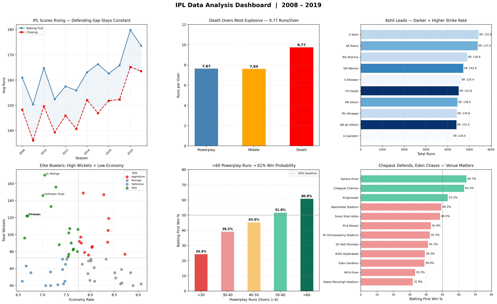
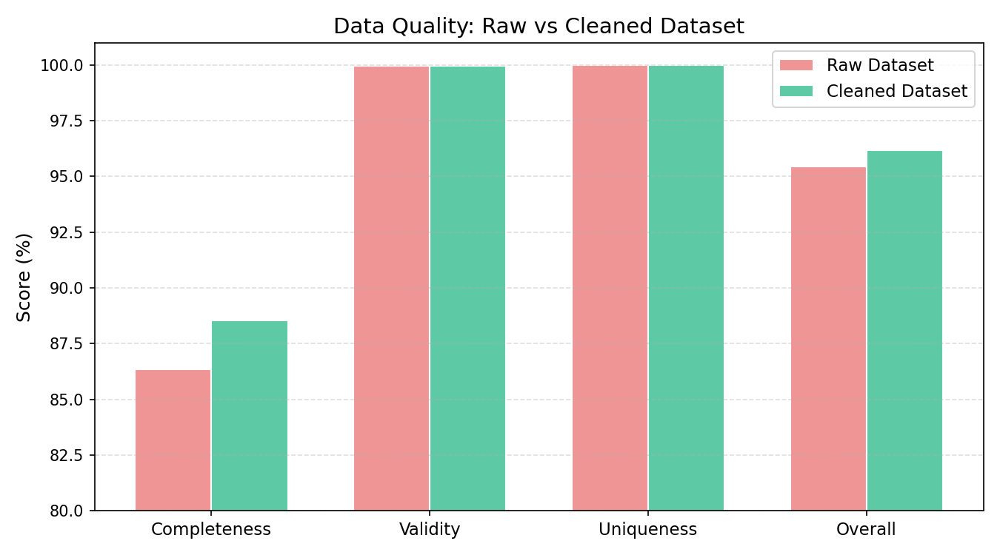
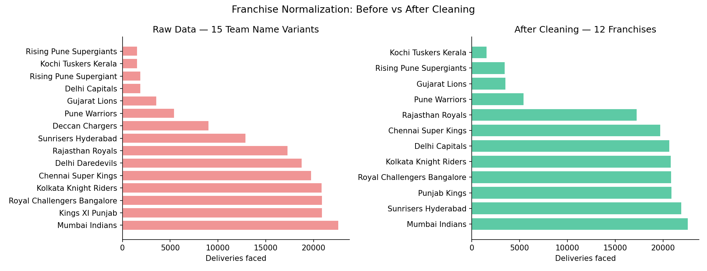
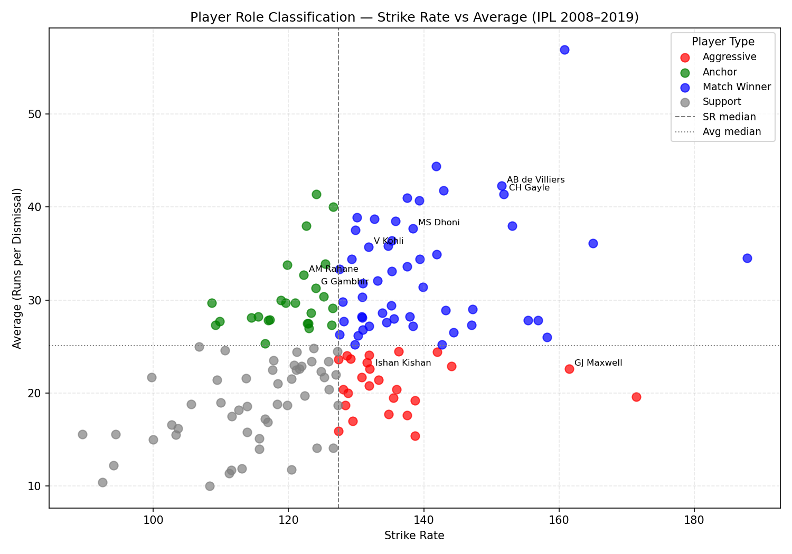
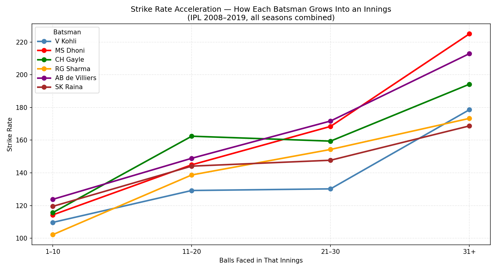
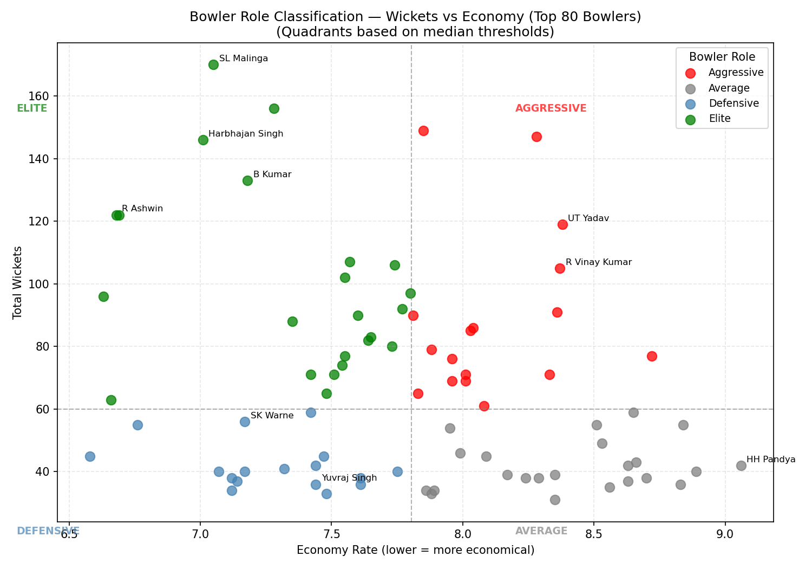
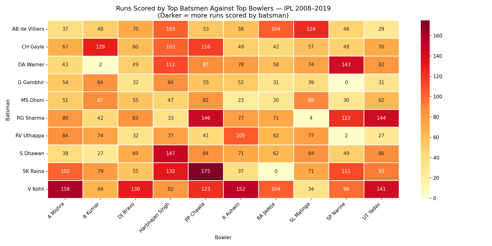
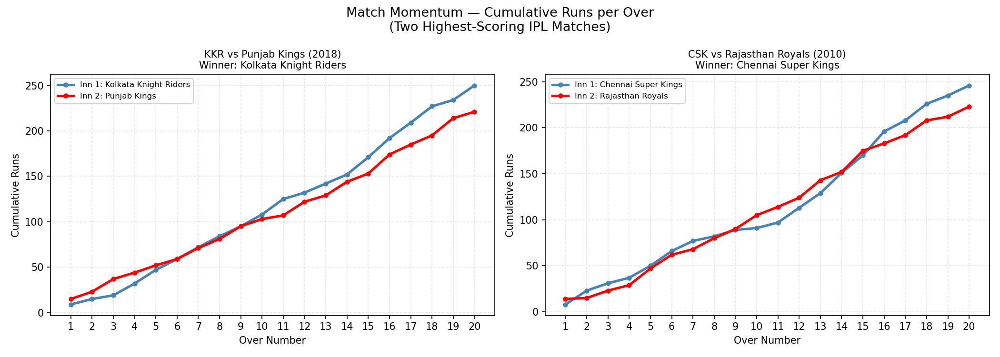
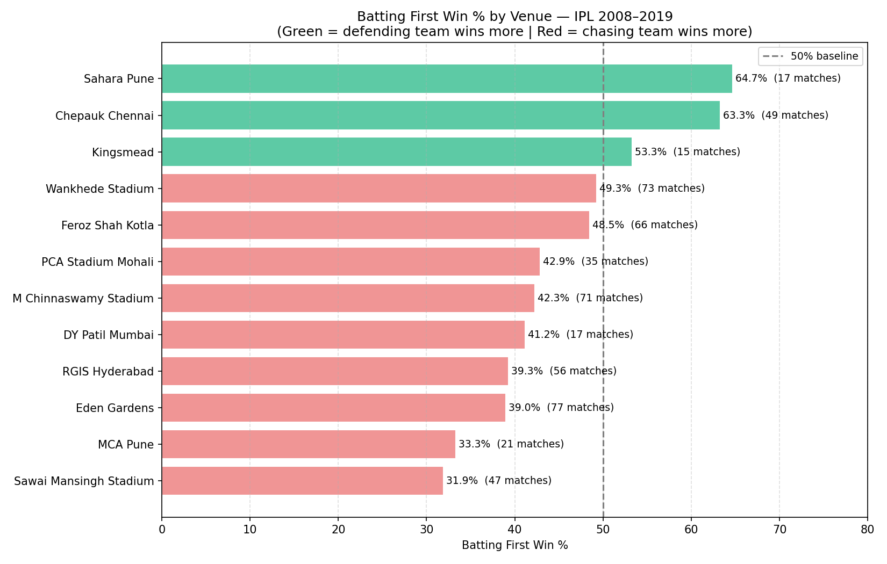

# IPL Performance Analytics 🏏📈

[](https://www.python.org/)
[](https://streamlit.io/)
[](https://pandas.pydata.org/)
[](https://matplotlib.org/)

An end-to-end data analytics and business intelligence project leveraging ball-by-ball Indian Premier League (IPL) data from **2008 to 2019** to uncover player efficiency, match strategy, and franchise dynamics. 

The project features a **Streamlit Dashboard** that serves interactive visual insights and executive summaries directly from raw match logs.

---

## 🖥️ Live Dashboard Preview

Below is a snapshot of the interactive dashboard showing the match summary, key performance indicators (KPIs), and analytical breakdowns.



---

## 📑 Table of Contents
* [Executive Summary](#-executive-summary)
* [Tech Stack](#-tech-stack)
* [Repository Structure](#%EF%B8%8F-repository-structure)
* [Data Pipeline & Module Breakdown](#-data-pipeline--module-breakdown)
  * [Module 1: Preprocessing & Normalization](#module-1-preprocessing--normalization)
  * [Module 2: Batting Performance Analysis](#module-2-batting-performance-analysis)
  * [Module 3: Bowling Efficiency Analysis](#module-3-bowling-efficiency-analysis)
  * [Module 4: Team Match Patterns](#module-4-team-match-patterns)
* [Strategic Analytical Takeaways](#-strategic-analytical-takeaways)
* [Local Installation & Setup](#%EF%B8%8F-local-installation--setup)
* [Cloud Deployment](#-cloud-deployment)

---

## 🎯 Executive Summary

In cricket analytics, traditional averages often fail to capture contextual performance (e.g., match phase, venue bias, or team situations). This project cleans, models, and visualizes historical IPL data to categorize players into specific roles (such as Anchors, Finishers, or Specialist Bowlers), profile venue-specific biases, and track match momentum. 

By converting complex Jupyter analyses into a production-grade Streamlit application, it bridges the gap between deep data science and executive decision-making.

---

## 🛠️ Tech Stack

* **Data Wrangling:** Python, Pandas, NumPy
* **Visualization:** Matplotlib, Seaborn
* **Web Dashboard:** Streamlit
* **Development Environment:** Jupyter Notebooks, VS Code

---

## 🗂️ Repository Structure

```text
.
├── matches.csv                  # Raw matches metadata (2008-2019)
├── deliveries.csv               # Raw ball-by-ball delivery logs (2008-2019)
├── streamlit_app.py             # Main Streamlit web application
├── requirements.txt             # Python project dependencies
├── Module1_Preprocessing.ipynb  # Phase 1: Data cleansing and normalization
├── Module2_Batting.ipynb        # Phase 2: Batsman clustering & score dynamics
├── Module3_Bowling.ipynb        # Phase 3: Bowler efficiency & matchup heatmaps
├── Module4_Patterns.ipynb       # Phase 4: Strategy, toss, & venue profiling
├── Module5_Dashboard.ipynb      # Phase 5: Dashboard visual mockups
├── dashboard_ipl.png            # Main dashboard overview screenshot
├── data/
│   ├── clean/                   # Cleaned datasets ready for quick loading
│   └── derived/                 # Generated aggregates (batting/bowling stats)
└── outputs/
    └── figures/                 # Rendered PNG charts used by the Streamlit app
```

---

## ⚙️ Data Pipeline & Module Breakdown

### Module 1: Preprocessing & Normalization
* **Goal:** Create a consistent, clean, and normalized data foundation.
* **Key Tasks:** 
  * Addressed missing records and resolved team rebrands/mergers (e.g., standardizing `Delhi Daredevils` to `Delhi Capitals`, `Deccan Chargers` to `Sunrisers Hyderabad`).
  * Filtered out illegal deliveries (no-balls, wide-balls) for clean batting rate calculations.
  * Mapped match-phase fields (`Powerplay`, `Middle Overs`, `Death Overs`) to each ball.

| Data Quality Check | Franchise Name Standardization |
|:---:|:---:|
|  |  |

---

### Module 2: Batting Performance Analysis
* **Goal:** Segment batsmen and study scoring acceleration across phases.
* **Key Tasks:**
  * Analyzed season scoring rates, boundary contribution, and strike-rate profiles.
  * Segmented batsmen into clear archetypes (e.g., Anchors vs. Finishers) based on their average vs. strike rate.
  * Plotted player-specific scoring acceleration curves as the innings progresses.

| Player Archetype Classification | Strike Rate Acceleration Profile |
|:---:|:---:|
|  |  |

---

### Module 3: Bowling Efficiency Analysis
* **Goal:** Quantify bowling impact by isolating phase-wise economy and matchups.
* **Key Tasks:**
  * Created head-to-head match-up matrices using strike-rate heatmaps.
  * Built specialized scatter plots matching Bowler Economy vs. Bowler Strike Rate.
  * Identified Powerplay and Death Overs specialist bowlers.

| Bowler Scatter (Economy vs SR) | Bowler-Batsman Matchup Matrix |
|:---:|:---:|
|  |  |

---

### Module 4: Team Match Patterns
* **Goal:** Evaluate the tactical influence of toss decisions, venue profiles, and momentum.
* **Key Tasks:**
  * Evaluated whether winning the toss translates to a higher win probability.
  * Analyzed chasing vs. defending dynamics across venues and seasons.
  * Formulated a "Match Momentum" indicator tracking cumulative run rates over an innings.

| Match Momentum Tracker | Venue-wise Defending vs Chasing Impact |
|:---:|:---:|
|  |  |

---

## 💡 Strategic Analytical Takeaways

1. **Phase-Specific Matchups:** Aligning specialized anchors in the Powerplay and aggressive finishers in the Death Overs maximizes team run output.
2. **Bowler Value Isolation:** A low overall economy rate can sometimes mask high variance across match phases. True impact bowlers (like Death specialists) maintain low economy under maximum pressure.
3. **Venue-Driven Strategy:** Teams that adapt their toss decisions (chase vs. defend) based on venue history rather than simple intuition gain a statistical edge in win margins.

---

## 🖥️ Local Installation & Setup

1. **Clone the repository:**
   ```bash
   git clone https://github.com/Hemantkumar-Lakhane/IPL_Performance_Analytics.git
   cd IPL_Performance_Analytics
   ```

2. **Set up a virtual environment (optional but recommended):**
   ```bash
   python -m venv venv
   source venv/bin/activate  # On Windows: venv\Scripts\activate
   ```

3. **Install the required packages:**
   ```bash
   pip install -r requirements.txt
   ```

4. **Launch the Streamlit app:**
   ```bash
   streamlit run streamlit_app.py
   ```

---

## ☁️ Cloud Deployment

The application is structured to support easy deployment on **Streamlit Community Cloud**:
1. Commit all files (including the static figures under `outputs/figures/` and `dashboard_ipl.png`).
2. Connect your GitHub repository to [Streamlit Cloud](https://share.streamlit.io/).
3. Set the entry point script path to: `streamlit_app.py`.
4. Deploy and share the live dashboard link!
